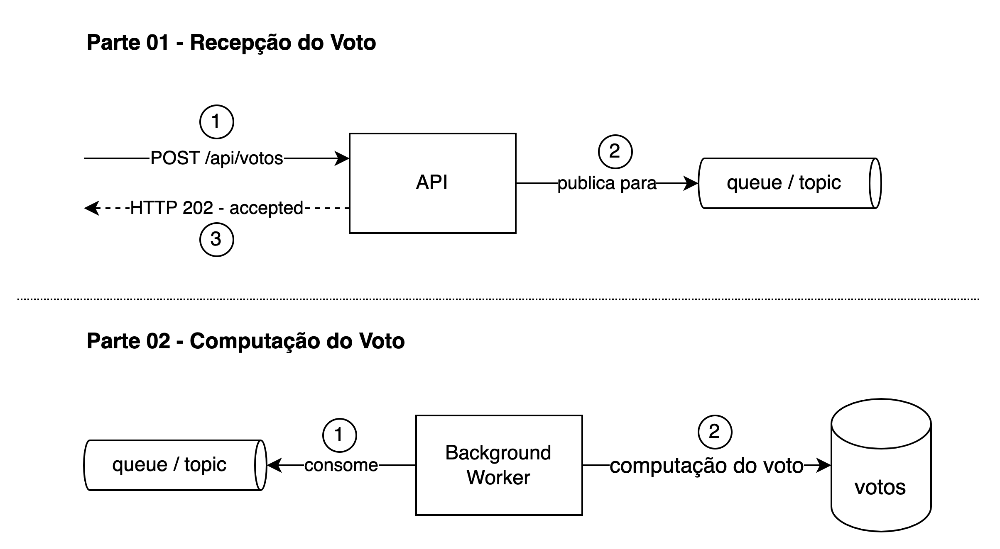

# eda-votacao-bbb

foco em alta performance, robustez, testes e boas práticas

- votos: milhares de requisições/segundo
- computação: registra o voto para contagem

### conceito

- os componentes se comunicam de forma assíncrona através de eventos
- a API emite eventos (votos) para uma fila
- um ou mais consumidores (workers) processam esses eventos, desacoplando totalmente a etapa de recebimento da etapa de processamento

### desafio 

https://dev.to/zanfranceschi/desafio-sistema-de-votacao-bbb-50e3

